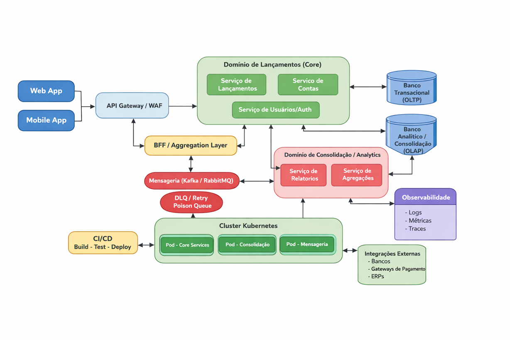

# Controle de Fluxo de Caixa -- Arquitetura de Soluções

## Visão Geral

Este projeto demonstra a definição de uma arquitetura de soluções para
controle de fluxo de caixa diário, contemplando lançamentos financeiros
(débitos e créditos) e a geração de um consolidado diário de saldo.

O foco está na tomada de decisões arquiteturais, decomposição de
domínios, definição de capacidades de negócio e atendimento a requisitos
funcionais e não funcionais como escalabilidade, resiliência,
disponibilidade e segurança.

------------------------------------------------------------------------

## Objetivos da Solução

-   Garantir alta disponibilidade do serviço de lançamentos
-   Permitir geração de relatório diário consolidado
-   Garantir que falhas no consolidado não impactem os lançamentos
-   Projetar solução escalável, resiliente e evolutiva

------------------------------------------------------------------------

## Visão Arquitetural

A solução utiliza arquitetura orientada a eventos com microsserviços,
garantindo desacoplamento entre domínios e tolerância a falhas.

### Estilo Arquitetural

-   Microsserviços
-   Event-driven
-   APIs REST
-   Comunicação assíncrona

------------------------------------------------------------------------

## Domínios e Capacidades

### Lançamentos Financeiros (Core Domain)

Capacidades: - Registrar créditos e débitos - Validar regras de
negócio - Persistir dados - Publicar eventos

Responsabilidades: - Fonte da verdade - Forte consistência - Alta
disponibilidade

------------------------------------------------------------------------

### Consolidação Diária (Supporting Domain)

Capacidades: - Consumir eventos - Agrupar por data - Calcular saldo
diário - Expor relatórios

Responsabilidades: - Processamento assíncrono - Consistência eventual -
Tolerância a falhas

------------------------------------------------------------------------

## Comunicação entre Serviços

  Origem        Destino        Tipo     Justificativa
  ------------- -------------- -------- ------------------------------
  Cliente       Lançamentos    REST     Operações críticas
  Lançamentos   Consolidação   Evento   Desacoplamento e resiliência

------------------------------------------------------------------------

## Requisitos Não Funcionais

-   Serviço de lançamentos independente do consolidado
-   Consolidação suporta até 50 req/s
-   Tolerância a até 5% de perda
-   Segurança com OAuth2 e JWT

------------------------------------------------------------------------

## Arquitetura Alvo

------------------------------------------------------------------------

## Tecnologias

-   Backend: .NET / Java / Node
-   Mensageria: Kafka ou RabbitMQ
-   Banco Lançamentos: PostgreSQL / SQL Server
-   Banco Consolidação: PostgreSQL / MongoDB
-   Infra: Docker / Docker Compose

------------------------------------------------------------------------

## Execução Local

docker-compose up -d

------------------------------------------------------------------------

## Considerações Finais

Projeto focado em clareza arquitetural e boas práticas, priorizando
decisões conscientes em detrimento de implementação completa.

------------------------------------------------------------------------

## Autor

Jorge Luis Oliveira Barros
